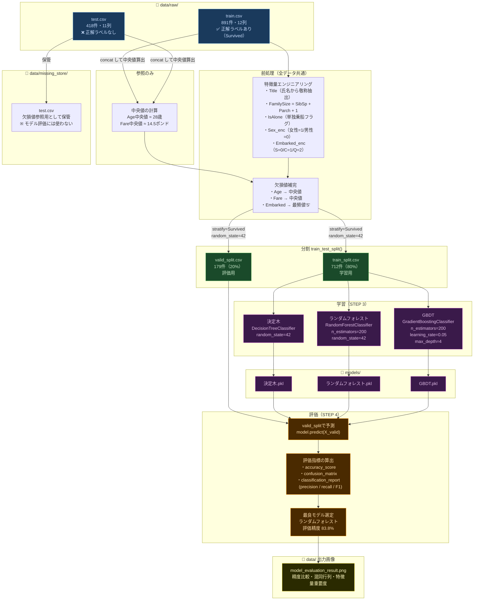

# データフロー図

## 全体の流れ

---

## 特徴量一覧（モデルへの入力）

| # | 特徴量 | 元の列 | 種別 |
|---|---|---|---|
| 1 | `Pclass` | そのまま | 元の特徴量 |
| 2 | `Sex_enc` | Sex | エンコード |
| 3 | `Age` | Age（欠損補完済み） | 元の特徴量 |
| 4 | `Fare` | Fare（欠損補完済み） | 元の特徴量 |
| 5 | `FamilySize` | SibSp + Parch + 1 | エンジニアリング |
| 6 | `IsAlone` | FamilySize == 1 | エンジニアリング |
| 7 | `Title` | Name から抽出 | エンジニアリング |
| 8 | `Embarked_enc` | Embarked | エンコード |
| 9 | `SibSp` | そのまま | 元の特徴量 |
| 10 | `Parch` | そのまま | 元の特徴量 |

目的変数（正解ラベル）: `Survived`（0=死亡 / 1=生存）

---

## 評価結果サマリー

| モデル | 学習精度 | 評価精度 | 差（過学習） |
|---|---|---|---|
| 決定木 | 98.3% | 83.2% | −15.1% |
| **ランダムフォレスト** | 98.3% | **83.8%** | −14.5% |
| GBDT | 93.3% | 83.2% | **−10.1%**（最安定） |
